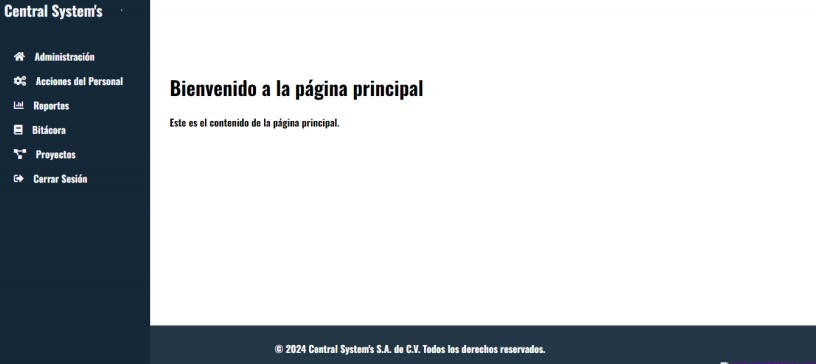
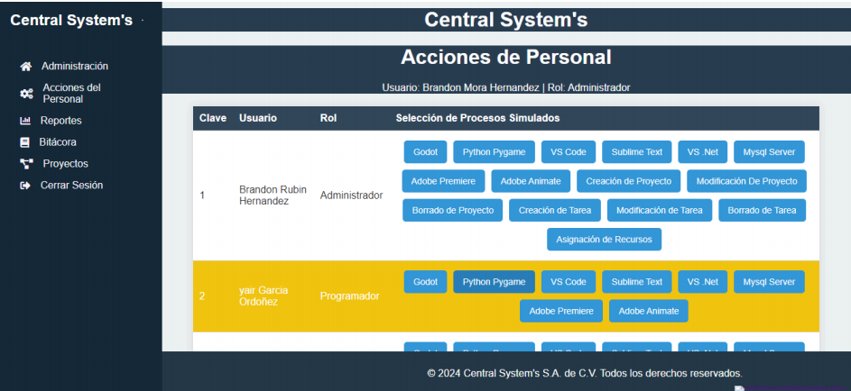
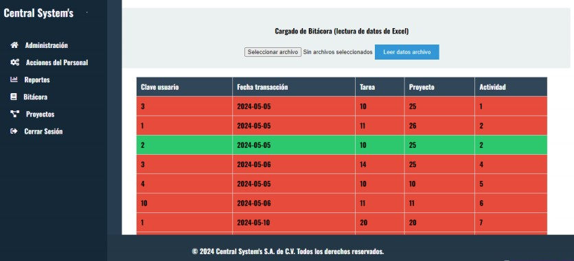
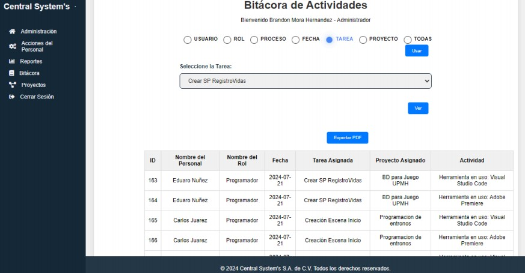

# 📘 Bitácora de Transacciones

**Bitácora de Transacciones** es un sistema de registro automatizado de acciones realizadas por el personal dentro de una organización. Este sistema permite documentar cada evento relevante como creación, modificación o eliminación de proyectos y tareas, de forma centralizada y trazable.

---

## Objetivo

El sistema tiene como propósito registrar de manera automática las transacciones realizadas por el personal, generando una bitácora que permite el seguimiento detallado de los procesos internos, asignaciones y roles del personal dentro de los distintos proyectos.

---

## Funcionalidades principales

### 📁 Gestión de Proyectos
- **Crear Proyecto**: Registra nombre, descripción, fechas y responsable.
- **Modificar Proyecto**: Actualiza los datos del proyecto existente.

### 📌 Gestión de Tareas
- **Crear Tarea**: Registra tareas asociadas a un proyecto.
### Validaciones
- Los **proyectos son únicos**.
- Las **tareas deben estar asociadas a un proyecto**.
- Un **personal solo puede tener una tarea activa**.
- Los **administradores no pueden ser asignados a tareas o proyectos**.
- Solo **usuarios administrativos** pueden acceder al sitio de la bitácora y gestionar contenido.

---

##  Tecnologías usadas

- ⚙️ **PHP** (interfaz y lógica del lado servidor)
- 💾 **MySQL** (base de datos y procedimientos almacenados)
- 🌐 **HTML/CSS** (estructura y estilos de la interfaz)
- 🔗 **SOAP** (servicios web)
- 📦 **Excel (.xlsx)** para carga masiva de datos
- 🖨️ **Exportación a PDF** para informes

---

## Inicio

  

## Login

  

## Pantalla Principal

  

## Simulador
Esta pantalla simula las acciones de usuarios (deberian ser registradas automaticamente con nagios)

  

## Cargado Masivo de datos
El usuario podia insertar varios datos a la bitacora, con la validación de que solo se insertara si tarea y actividad correspondian a la tabla raiz "Proyecto", las inserciones correctas se marcan en verde y los errores en rojo

  

## Bitácora
Un reporte de todos los datos insertados en bitacora, se puede filtrar por usuario, rol, proceso, fecha y proyecto, ademas de exportar a PDF

  

